# Customer 360 — Lakebase Capstone (Streamlit)

A production-style **Customer 360** application built on **Databricks Apps** +
**Lakebase** (managed Postgres), deployed as a **git-source app** via Databricks
Asset Bundles. It reads live customer data from Lakebase synced tables, lets
users add notes / override segments (written back to gold via a forward-ETL
job), embeds an AI/BI dashboard, and answers natural-language questions through
a Genie chat.

> **Track:** Streamlit (per `CAPSTONE_TASKS_STREAMLIT.md`).

---

## Architecture at a glance

```
Gold Delta tables (suro_cat.app_capstone)
        │  reverse ETL (T1)
        ▼
Lakebase Postgres (capstone-pg)
  ├─ *_synced      ← read path  (customers/transactions CONTINUOUS, products TRIGGERED)
  └─ *_staging     ← write path (notes, segment overrides, audit log)
        │  forward ETL job (T7): MERGE staging → gold
        ▼
Gold Delta tables (customer_notes, customer_segment_overrides)

Streamlit app (Databricks Apps, git-source)
  ├─ Customers list / Customer detail   → Lakebase via SP
  ├─ Metrics (per-customer aggregates)  → SQL warehouse via OBO (calling user)
  ├─ Dashboard (embedded iframe)        → AI/BI dashboard
  ├─ Genie chat                         → Genie Conversation API via OBO
  └─ Reports (trigger forward ETL)      → Jobs API via SP
```

### Identities (T2)
- **OBO (On-Behalf-Of)** — user-scoped calls (SQL warehouse metrics + Genie) run
  as the *calling user* via the `X-Forwarded-Access-Token` header, so workspace
  RLS/audit see the real user.
- **Service Principal (SP)** — all Lakebase access + the forward-ETL job trigger.
- Lakebase does **not** support OBO scopes, so **all DB access is via the SP**,
  and the acting user is recorded from `X-Forwarded-Email` in the audit log.

---

## App walkthrough (screenshots)

The deployed Customer 360 app, one screenshot per page. All pages read live data
(Lakebase synced tables via the SP; Metrics + Genie as the calling user via OBO).

### Overview
Landing page summarizing the customer base and app capabilities.

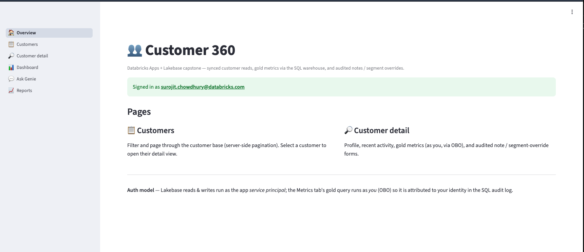

### Customers
Server-side paginated, filterable customer list backed by `customers_synced`
(sub-10ms Lakebase reads via the service principal). Row selection drives the
detail view.

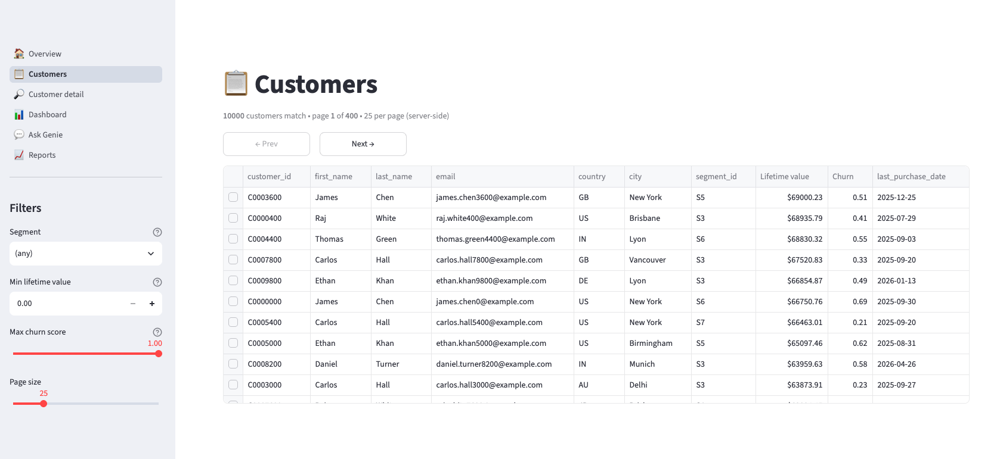

### Customer detail
360° profile with tabs — Profile, Activity (recent transactions), Notes, and
Segment. Notes and segment overrides are written to Lakebase staging (with an
atomic audit-log entry); the expensive per-customer Metrics query runs against
the SQL warehouse **as the calling user (OBO)** only when its tab is active.

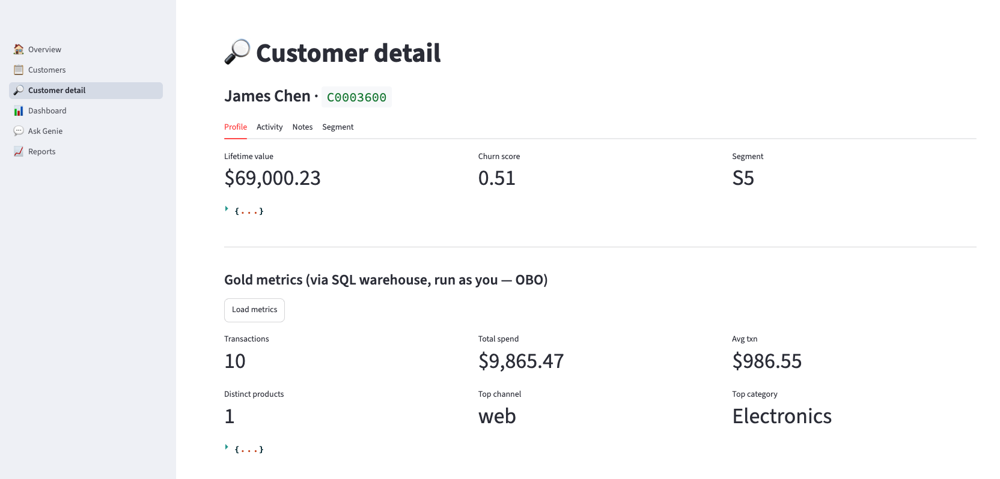

### Dashboard
Embedded AI/BI dashboard. Rendered via the external-user token flow (the app SP
mints a short-lived, dashboard-scoped OAuth token server-side and hands it to the
`@databricks/aibi-client` renderer), so it works cross-origin from the app domain.

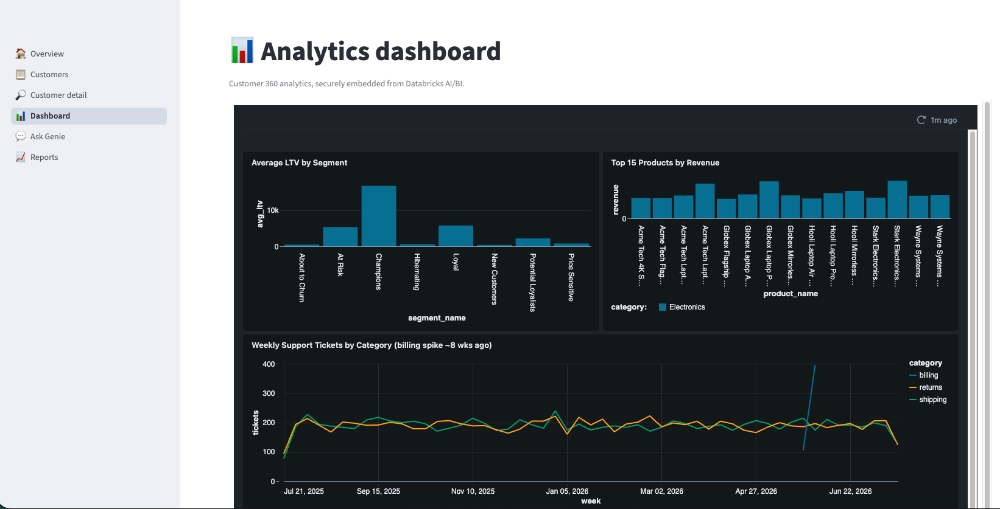

### Ask Genie
Natural-language chat over the data via the Genie Conversation API, run **as the
calling user (OBO)**. Multi-turn context is preserved within a conversation, and
query-result attachments render as tables.

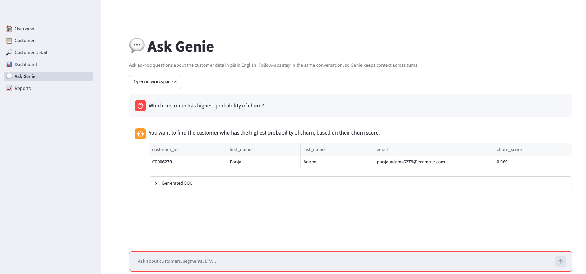

### Reports
Triggers the forward-ETL job (staging → gold `MERGE`) via the Jobs API as the SP,
with live run status and recent-runs history.

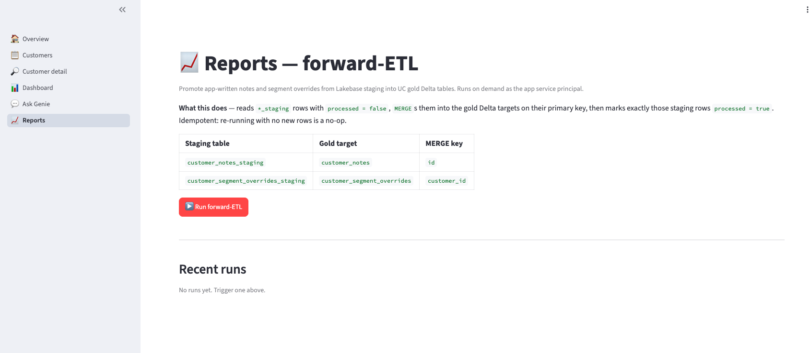

---

## T9 — Lakebase ops (screenshots)

Hands-on Lakebase operations demonstrating recovery and query-performance tuning.
Two exercises: **T9a** — database branch + point-in-time restore (PITR); **T9b** —
adding an index and observing the query plan/latency change.

### T9a — Branch + point-in-time restore

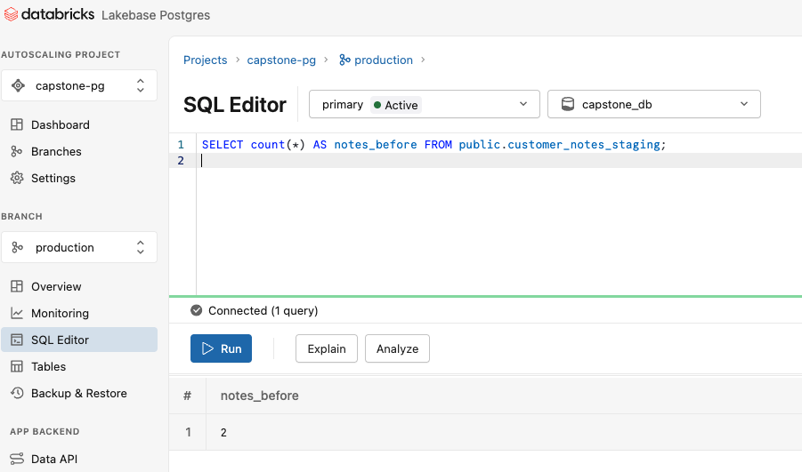

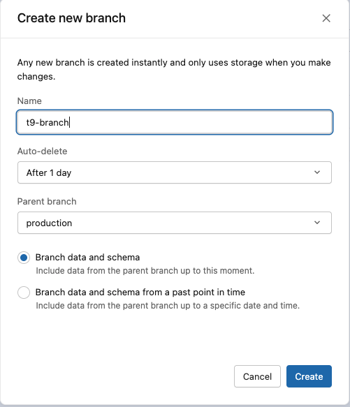

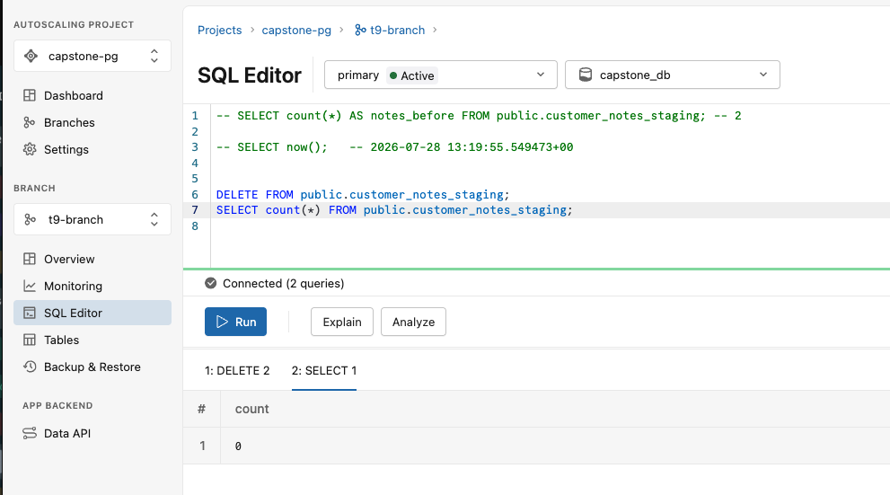

### T9b — Index & query performance (before → after)

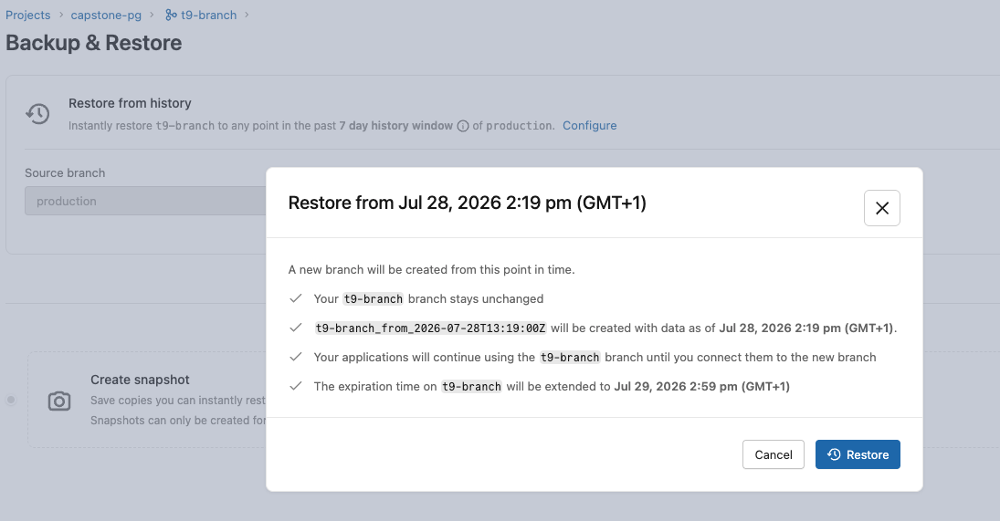

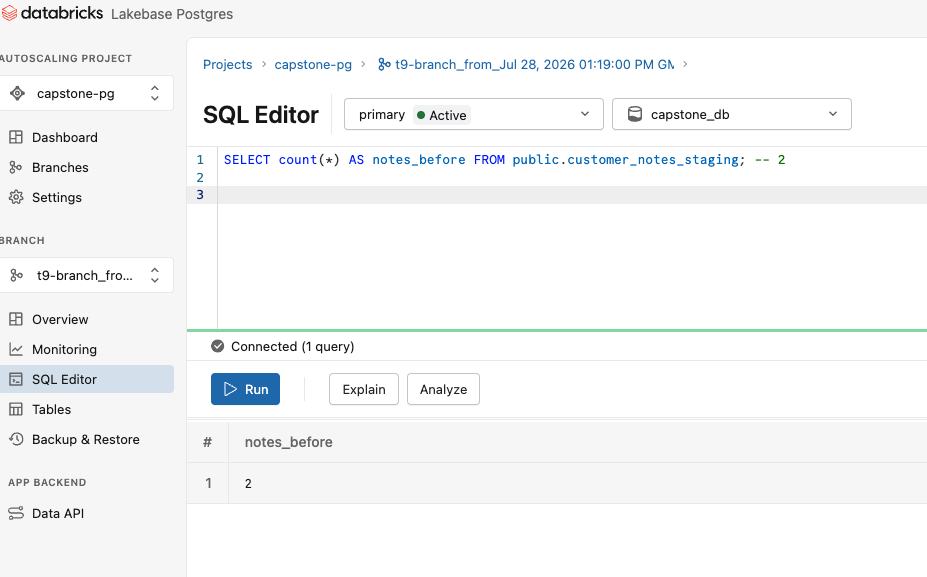

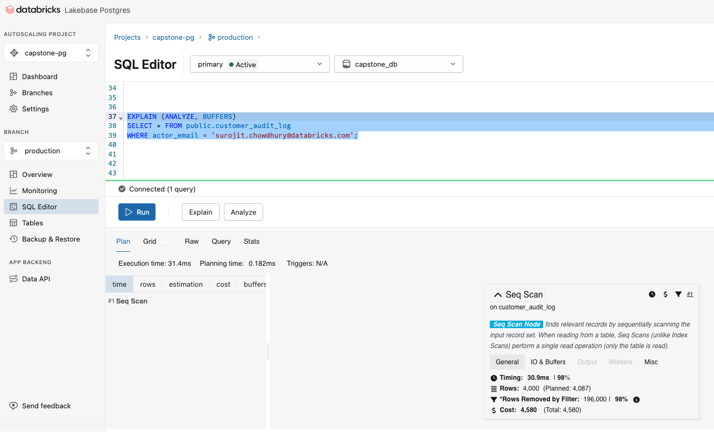

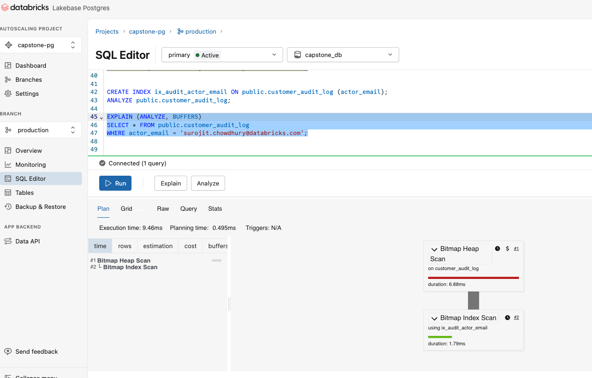

---

## Repo layout

| Path | What |
|------|------|
| `app/streamlit_app.py`, `app/pages/` | Streamlit UI (Customers, Detail, Dashboard, Genie, Reports) |
| `app/lib/` | Data + auth layer: `auth.py`, `db.py`, `data.py`, `sql.py`, `genie.py`, `jobs.py`, `config.py` |
| `app/app.yaml` | App runtime config (command, env, dynamic port, proxy settings) |
| `app/requirements.txt` | Pinned Python deps |
| `lakebase/reverse_etl/` | T1 — synced tables, staging tables, SP grants |
| `lakebase/forward_etl/pattern_a_psycopg2/` | T7 — forward-ETL notebook + job creator |
| `resources/` | Bundle resources: `app.yml` (git-source app + `user_api_scopes`), `jobs.yml` (forward-ETL job) |
| `databricks.yml` | Asset Bundle root (targets, variables) |

---

## Task mapping (T1–T9)

| Task | Delivered in |
|------|--------------|
| **T1** Reverse ETL | `lakebase/reverse_etl/` — synced tables (CONTINUOUS/TRIGGERED), staging tables, grant script |
| **T2** Auth (OBO + SP) | `app/lib/auth.py`, `app/lib/db.py` |
| **T3** Data layer + UI | `app/lib/data.py`, `app/lib/sql.py`, `app/pages/1_Customers.py`, `2_Customer_Detail.py` |
| **T4** Dashboard embed | `app/pages/3_Dashboard.py`, `app/lib/config.py` |
| **T5** Genie chat | `app/lib/genie.py`, `app/pages/4_Genie.py` |
| **T6** `app.yaml` config | `app/app.yaml`, `resources/app.yml` (`user_api_scopes`) |
| **T7** Forward ETL | `lakebase/forward_etl/pattern_a_psycopg2/`, `app/lib/jobs.py`, `app/pages/5_Reports.py` |
| **T8** Deploy via DABs | `databricks.yml`, `resources/app.yml` (git-source app) |
| **T9** Lakebase ops | Branching + PITR, index/query-perf — performed live in Lakebase (screenshots in submission) |

---

## Deploying (git-source app)

The app pulls its source from **this GitHub repo** at deploy time (source-folder
uploads are not used). Run from the repo root:

```bash
# 1. Deploy the bundle (creates the app + forward-ETL job)
databricks bundle deploy --target prod \
  --var git_repo_url=https://github.com/surojitchowdhury/gdc-apps-lakebase-capstone

# 2. Get the app's service-principal id
databricks apps get customer360   # note service_principal_id

# 3. Bind a GitHub credential to that SP (only needed for PRIVATE repos)
#    Public repos need no credential.
databricks git-credentials create gitHub \
  --personal-access-token <PAT> --principal-id <APP_SP_ID>

# 4. Pull source + start the app
databricks bundle run customer360 --target prod \
  --var git_repo_url=https://github.com/surojitchowdhury/gdc-apps-lakebase-capstone
```

### Workspace-admin toggles (one-time, in the UI)
- **OBO:** *Settings → Apps → User authorization (preview)* = ON, then click
  **Authorize** on first app load. Required for the Metrics tab + Genie.
- **Dashboard embed:** *Settings → Security → External Access → Embed Dashboard*
  → add the app's host. Required for the Dashboard page iframe.

---

## Design decisions (submission writeup)

### CONTINUOUS vs TRIGGERED synced tables (T1)
- `customers_synced`, `transactions_synced` → **CONTINUOUS**: they change often
  and the app must reflect updates within seconds; the ongoing pipeline compute
  is justified by freshness.
- `products_synced` → **TRIGGERED hourly**: a slow-changing catalog; a
  continuous pipeline would waste compute, so an hourly cron-triggered job keeps
  it fresh cheaply.

### Synced-table storage (infra note)
A Lakebase database catalog is connection-backed with **no managed storage**, so
the synced tables' backing DLT pipelines have nowhere to write pipeline
metadata. We redirect just the pipeline metadata to a storage-backed catalog via
`SyncedTableSpec.new_pipeline_spec` (`storage_catalog`/`storage_schema`) while the
synced tables themselves stay in the Lakebase catalog and remain Postgres-readable.

### Forward ETL — Pattern A (T7)
On-demand job (as the SP): read `*_staging WHERE processed=false` → `MERGE INTO`
gold → mark exactly those rows `processed=true`. The mark predicate matches the
**full merged payload** (not just a timestamp) so a concurrent newer write is
never lost. Idempotent: re-running with nothing new is a no-op. Segment overrides
materialize to a dedicated gold table to avoid fighting the reverse-ETL sync that
keeps `customers` fresh.

### Optimizations & hygiene
- **Pagination:** server-side, `page_size` default 25 / hard-capped at 100 —
  never loads the full table.
- **Caching:** `@st.cache_data` with per-concern TTLs (config 300s, list 10s,
  detail 30s, metrics 60s); connection pool + SP client in `@st.cache_resource`;
  writes clear/bump the relevant cache key.
- **Connection pooling:** shared Lakebase pool with fresh OAuth token per checkout.
- **SQL:** all parameterized (no f-string user input); minimal column selection.
- **Streamlit:** expensive Metrics query deferred to its active tab; navigation/
  selection state persisted in `st.session_state`.

---

## Local development

```bash
cd app
uv sync                     # or: pip install -r requirements.txt
# create app/.env with your workspace values (gitignored — never committed)
streamlit run streamlit_app.py
```

`app/.env` is intentionally **gitignored**; the deployed app reads config from
`app.yaml` / bundle variables, not from `.env`.
